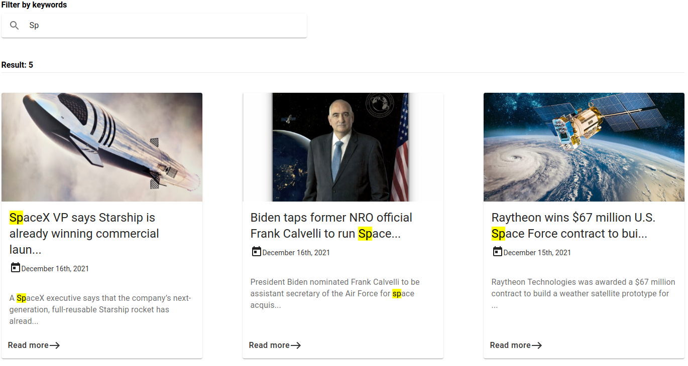

# News application

[Deploy of application](https://articles-typescript.netlify.app/)

# TECHNOLOGIES

- [React](https://reactjs.org/)
- [Redux](https://redux.js.org/)
- [TypeScript](https://www.typescriptlang.org/)
- [MaterialUI](https://mui.com/)
- [Sass](https://sass-lang.com/)

# INSTALLATION

1. Install [node.js & npm](https://nodejs.org/en/) on your computer.
2. Copy link of repository.
3. Open terminal/console and enter _git clone < link of repository >_.
4. Open folder of repository in terminal/console and enter _npm start_
